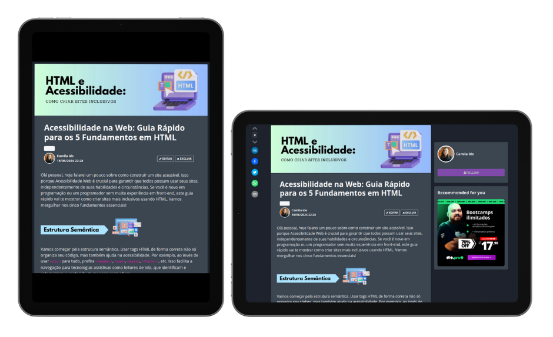

<p align="center">
    
</p>


<p align="center">
  <a href="https://dio.me/">
  </a>
  
  </a>
</p>

-------

<p align="center">
  
</p>

# Projeto artigo técnico gerado por I.A.s


 > ℹ️ **NOTE:** Este é o repositório desenvolvido durante o Bootcamp Santander 2024 - Fundamentos de IA para Devs.

Projeto com o objetivo de gerar um artigo técnico com um layout rico, leitura agradável e com foco em promover sua autoridade técnica.

<a href="https://web.dio.me/articles/diretivas-estruturais-versus-diretivas-de-atributo-qual-usar-no-angular?back=%2Farticles&page=1&order=oldest#state=044ab194-1e3a-4b8e-95fe-c0f6b3b5260e&session_state=efdc9591-d6fe-4d79-ae97-e58af45061da&code=5ac231e4-c722-46c3-bb7f-32ce5363fb78.efdc9591-d6fe-4d79-ae97-e58af45061da.a889d5a2-0d02-46df-83a5-28a1b4ac39ab" title="View PDF now"> 📕Clique aqui para ler o artigo</a>

## 💻 Tecnologias utilizadas no projeto

- [ChatGPT](https://chat.openai.com/) - para título e conteúdo
- [Canva](https://www.canva.com/) - Para formatação de banners, Layouts e imagens


## 📄 Prompts e ferramentas


ChatGPT：

|   Ação   | prompt                                                                                                                                                                                                                                                                         |
| :------: | ------------------------------------------------------------------------------------------------------------------------------------------------------------------------------------------------------------------------------------------------------------------------------ |
|  título  | Crie 10 headlines para nomes de artigos sobre o assunto HTML: Boas práticas em acessibilidade |                                             |
| conteúdo | ```Comporte-se como um escritor de artigo tech Front-end e escreva um artigo com as regras abaixo:
> O título do artigo é: "HTML e Acessibilidade: Como Criar Sites Inclusivos";
> O Subtítulo é: "Acessibilidade na Web: Guia Rápido para os 5 Fundamentos em HTML";
> Cada bloco terá de 2 a 3 parágrafos no máximo;
> Cada parágrafo terá no máximo 5 linhas;
> Deverá conter 1 parágrafo de introdução e 1 de conclusão;
> Tenha um tom de voz informal;
> O texto deve ser compreendível para pessoas com pouco conhecimento em programação;
> O texto deve ser compreendível para programadores sem conhecimento em front-end;
> Os blocos a serem criados são: "Estrutura Semântica", "Textos Alternativos", "Contraste de Cores", "Foco Visível", e "Legendas e Transcrições";
> Cada bloco deve conter um exemplo em forma de código;
> Faça um call to action para as minhas redes sociais: Github e LinkedIn;
> Coloque 3 hashtags que façam sentido.```|


## ✨ Features

- Conteúdo gerado via ChatGPT
- Imagens do acervo da plataforma Canva


